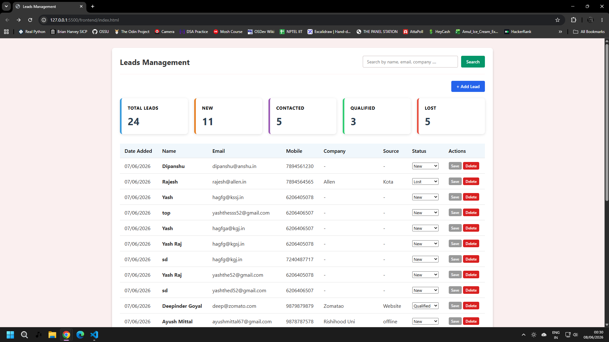
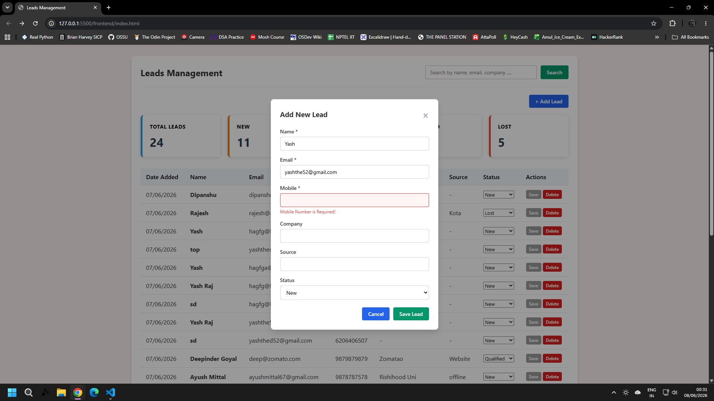
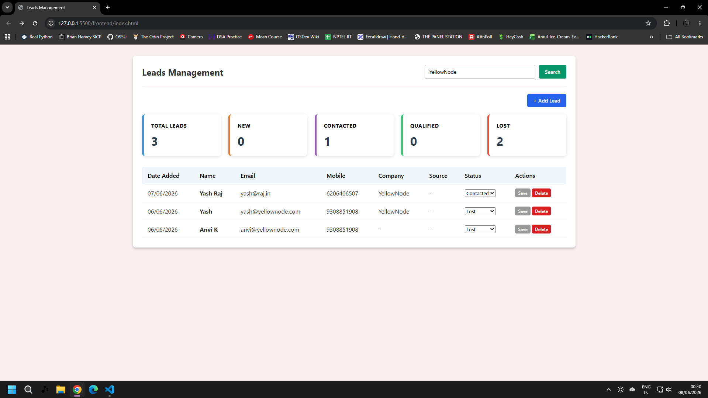

# Lead Management System (CRM Module)

## Project Overview

The Lead Management System is a simple CRM (Customer Relationship Management) module that allows sales teams to capture, manage, track, and search sales leads through a structured pipeline.

### Features

* Add New Lead
* View All Leads
* Search Leads by Name, Mobile, or Company
* Update Lead Status
* Delete Lead
* Dashboard Statistics
* Form Validation
* Backend API Development
* MySQL Database Storage

### Lead Status Flow

```text
new → contacted → qualified
                     ↓
                   lost
```

---

# Technologies Used

## Frontend

* HTML
* CSS
* JavaScript

## Backend

* Node.js
* Express.js

## Database

* MySQL

### Additional Packages

* mysql2
* dotenv
* cors
* nodemon


---

## Project Structure

```text
LEAD CAPTURE SYSTEM
│
├── backend/
│   │
│   ├── src/
│   │   │
│   │   ├── config/
│   │   │   └── db.js
│   │   │
│   │   ├── controllers/
│   │   │   └── leadControllers.js
│   │   │
│   │   ├── models/
│   │   │   └── leadModels.js
│   │   │
│   │   └── routes/
│   │       └── leadRoutes.js
│   │
│   ├── .env.example
│   ├── .gitignore
│   ├── package.json
│   ├── package-lock.json
│   └── server.js
│
├── database/
│   ├── schema.sql
│   └── sample_data.sql
│
├── frontend/
│   │
│   ├── css/
│   │   └── style.css
│   │
│   ├── scripts/
│   │   ├── api_calls.js
│   │   └── app.js
│   │
│   └── index.html
│
└── README.md
```


---

# Installation Steps

## 1. Clone Repository

```bash
git clone https://github.com/dev-yashraj52/lead-capture-system
```

## 2. Navigate to Project Folder

```bash
cd lead-management-system/backend
```

## 3. Install Dependencies

```bash
npm install
```

## 4. Configure Environment Variables

Create a `.env` file using `.env.example`.

Example:

```env
PORT=5000

DB_HOST=localhost
DB_USER=root
DB_PASSWORD=your_password
DB_NAME=lead_management
```

## 5. Setup Database

Open MySQL Workbench (or any MySQL client).

Run:

```text
database/schema.sql
```

This creates:

* Database
* Leads table

(Optional)

Run:

```text
database/sample_data.sql
```

This inserts sample lead records for testing.

### 6. Start Server

```bash
npm start
```

For development:

```bash
npm run dev
```

### 7. Open Application

Visit:

```text
http://localhost:3000
```

The frontend is served automatically by Express.js.


---

# Database Setup

The database setup files are included inside the project.

### schema.sql

Creates:

* Database: `lead_management`
* Table: `leads`

### sample_data.sql

Adds sample records for testing and demonstration purposes.

---

# API Endpoints

| Method | Endpoint            | Description   |
| ------ | ------------------- | ------------- |
| GET    | /leads              | Get all leads |
| GET    | /leads?search=value | Search leads  |
| POST   | /leads              | Create lead   |
| PUT    | /leads/:id          | Update lead   |
| DELETE | /leads/:id          | Delete lead   |

---

# Dashboard

The dashboard provides:

* Total Leads Count
* New Leads Count
* Contacted Leads Count
* Qualified Leads Count
* Lost Leads Count

---

# Screenshots

### Dashboard



### Add Lead Form



### Search



---

# Author

Yash Raj

GitHub: dev-yashraj52
